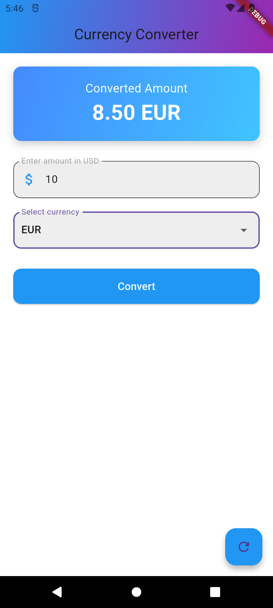

# Modern Currency Converter App

A sleek and stylish currency converter built with Flutter. This app allows users to convert amounts between USD and HUF, featuring an enhanced modern UI with additional features for better usability.

## Features

- **Modern UI**: Beautiful gradients, smooth animations, and a user-friendly layout.
- **Currency Selection**: Switch between USD and HUF using a dropdown menu.
- **Error Handling**: Real-time input validation with error messages for invalid inputs.
- **Reset Functionality**: A floating action button to quickly reset the input and output fields.
- **Responsive Design**: Works seamlessly on both mobile and tablet devices.

## Installation

To run the app locally:

1. Clone the repository:

    ```bash
    git clone https://github.com/your-username/modern-currency-converter.git
    ```

2. Navigate to the project directory:

    ```bash
    cd modern-currency-converter
    ```

3. Install dependencies:

    ```bash
    flutter pub get
    ```

4. Run the app:

    ```bash
    flutter run
    ```

## Usage

1. Enter an amount in the input field.
2. Select the desired currency (USD or HUF) from the dropdown menu.
3. Tap the "Convert" button to see the converted value.
4. Use the reset button (floating action button) to clear the input and output fields.

## Screenshot



## File Structure

- `main.dart`: App entry point and theme setup.
- `currency_converter_material_page.dart`: Contains the main UI and currency conversion logic.